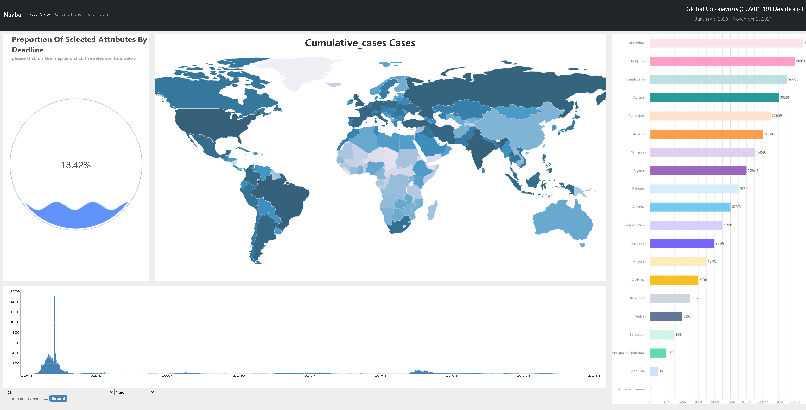

<!-- @import "[TOC]" {cmd="toc" depthFrom=1 depthTo=6 orderedList=false} -->

<!-- code_chunk_output -->

- [Global Coronavirus (COVID-19) Dashboard](#global-coronavirus-covid-19-dashboard)
  - [效果展示](#效果展示)
    - [OverView 中截止日期概览情况](#overview-中截止日期概览情况)
    - [Vaccinations 世界疫情概述情况](#vaccinations-世界疫情概述情况)
    - [Data Table 中世界疫情累计概述情况](#data-table-中世界疫情累计概述情况)
  - [可视化系统中的典型案例分析](#可视化系统中的典型案例分析)
    - [(1)关于世界截止目前疫情严重程度分析](#1关于世界截止目前疫情严重程度分析)
    - [(2)关于世界截止目前疫苗接种程度分析](#2关于世界截止目前疫苗接种程度分析)
    - [(3)关于世界截止日前接种情况与年龄的分析](#3关于世界截止日前接种情况与年龄的分析)
    - [(4)关于世界截止日前疫苗制造商来源分析](#4关于世界截止日前疫苗制造商来源分析)
  - [快速上手](#快速上手)
    - [首次启动请安装依赖](#首次启动请安装依赖)
    - [启动](#启动)
    - [打包](#打包)

<!-- /code_chunk_output -->

# Global Coronavirus (COVID-19) Dashboard

针对 WHO 提供的世界疫情数据做 2020.1.3 - 2021.11.23 的疫情概览情况; 支持动态扩展数据;同时针对 Our World in Data 组织提供的世界疫苗数据做 2021.2.22 - 2021.11.22 的疫苗探索分析；

## 效果展示

### OverView 中截止日期概览情况

- 世界累计病例地图可视化；
- 世界疫情累计死亡前 20 排名可视化；
- 世界疫情时间序列柱状图可视化；
- 世界疫情选择比例 liquidPlot 可视化；


本页面主要是描述截止到 2021.11.23 日，世界部分国家的疫情发展情况。首先可以通过地图的颜色深浅判断出世界各地累积病例的数量多少情况。点击地图中的某一个国家地图版块进行交互，左边的流量占比图和下方的条形图分别转化到相对应国家相关的属性。进而可以得到该国家的疫情数据具体信息以及随时间变化各个国家的具体变化。

### Vaccinations 世界疫情概述情况

- 世界疫苗完全接种、部分接种、加强针接种等情况可视化；
- 世界疫苗趋势可视分析情况；
- 世界制造商接种疫苗可视化；
- 世界按年龄分布对比分析可视化；
  

本页面主要是展示截止到 2021.11.22 日，世界上部分国家疫情接种情况。从整个页面来看右边是代表国家名称的列表选择框，中间是表示某个时间段内各个国家疫苗接种情况。下面的下拉框就是具体属性包括每日接种疫苗数量、完成一次接种的人数、完成两次接种的人数、接种加强针的人数、每百人接种接种疫苗情况、每百人接种一针剂的数量、每百人接种两针剂的数量、每百名接种加强针数量、每日每百万人接种疫苗情况、每日每 100 人接种疫苗情况等。

### Data Table 中世界疫情累计概述情况

- 各地区、国家累计、死亡、近七日病例总览可视化；
- 各地区、国家详细时间序列趋势分析可视化；


整个页面主要是展示各地区、各国家疫情情况。包括累计病例、死亡病例、近 7 日新增病例、近 7 日死亡病例。整个页面是一个列表的形式。当点击某一个表项时，就会出现该国家的具体疫情变化的折线图。从图中可以观察到某个国家的疫情数据变化情况以及整个发展趋势，进而可以大致了解该国家的疫情防控工作的开展情况，同时通过排序，我们也能明显的查看每一列属性国家排名以及对应的详细信息。

## 可视化系统中的典型案例分析

### (1)关于世界截止目前疫情严重程度分析

从最开始的 OverView 的页面展示来看，我们明显的发现 United States of America、Russian F ederation、India、Brazil 等国家的累计病例从地图展示来看是比较严重的，同时，当我点击了对应颜色比较深的国家之后，对应截止日期下，我能查看对应所选国家所占所选病情所占所有里面的比例，结合后面的 dataTable 的数据，我们除了发现死亡率比较高的美国 18.42%之外，还有印度地区的 13.41%，地区小，但累计病例和死亡率都远超其他国家，和当地的地区的环境和社会政治有关系；而在 Brazil 中的所占的 8.55%，位居第三，也与当地政府（经过查询）有明显关系。综上的几个国家，我们都能明显看出其疫情防控性和政府、经济、领导者有直接联系，这与我们国家的疫情防控情况形成鲜明的对比。

### (2)关于世界截止目前疫苗接种程度分析

① 　令我们吃惊的是，世界排名第一的疫苗接种率非中国，而是以 United Arab Emirates（阿拉伯联合酋长国）、Cuba(古巴)、Portugal（葡萄牙）等国家为首的分别近 99%、90%、89%的接种率，中国截止时间以 85%排名第六；但中国试用总剂量远超其他国家，齐次是 India，都受到人口基数大的原因。
② 　通过分析时间段，我们发现普遍进行接种高涨期是 5、6、7 月份，部分国家在 8、9 月份比较集中，与我们实际生活也相符合。
③ 　通过 Daily number of COVID-19 vaccinations administered per 100 people（每 100 人每天接种的 COVID-19 疫苗数量）可以看出，中国排名远超其他国家，主要集中在 6、7、8 月份，集中性明显。印度、巴西、印度尼西亚等国家增长缓慢。与国家政策经济有很大关系；
④ 　通过分析对接受疫苗接种方案规定的所有剂量的总人数进行分析之后，我们发现完全接种人数中国远超其他国家，齐次是 India、US、Brazi、Russia 等国家。但是由于人口基数，我们并不能直接根据比例去衡量疫苗的接种程度。
通过对加强针的使用情况进行分析，主要集中在 10、11、12 月份，这与 5、6 月份之后的一、二剂相对应，对应着加强针的间隔时间长短；主要国家为 Chile、Israe、Uruguay、United States 等。

### (3)关于世界截止日前接种情况与年龄的分析

通过对疫苗的使用情况与年龄进行分析，主要集中在年龄较高当中（50 以上），通过漏斗图的展示，颜色通过下图的图例展示出的年龄段，并且通过左右我们能够查看到的 people_vaccinated_per_hundred 和 people_fully_vaccinated_per_hundred 发现，至少接种一针和完全接种基本相似，得出一般接种过一针的人，都会有意愿去接种第二针。

### (4)关于世界截止日前疫苗制造商来源分析

通过对每个国家疫苗制造商聚类分析，并通过表格的形式展现出具体的给予量，可以分析得出外国主要集中于 Pfizer/BioNTech、Oxford/AstraZeneca、Moderna、Sinovac、Johnson&Johnson 等制造商；中国主要来源于 CanSino、Sinopharm/Beijing、 Sinovac、ZF2001、Sinopharm/Wuhan。

## 快速上手

### 首次启动请安装依赖

```
npm install
```

### 启动

```
npm run start
```

### 打包

```
npm run build
```
